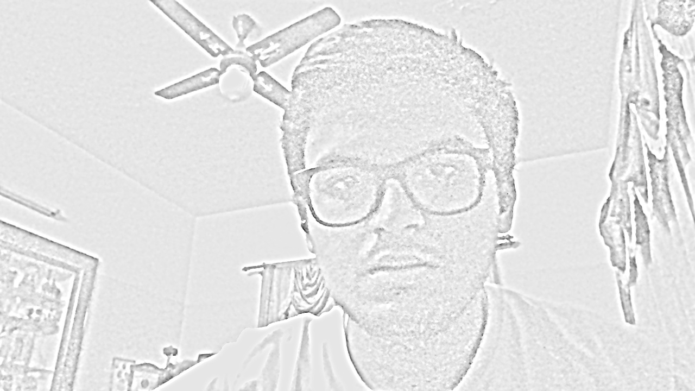
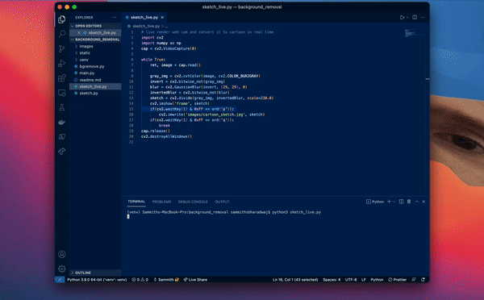

<h1>Main.py</h1>
In this file, we try to create an openCV app that removes background of a person in real time and adds a different background.
Using the video https://www.youtube.com/watch?v=k7cVPGpnels for initial learning of how OpenCV works.

We are trying to build a background removal app and the modules used here are cvzone and mediapipe.

Import the SelfiSegmentation from cvzone.SelfiSegmentationModule.

First start capturing live camera feed and set height and weight of output.

We create a SelfiSegmenation object and that removes the background from the image, we can set what colors we want to replace beckgropund with too.

cv.CAP_PROP_FPS is used to get higher frame rates than usual, max you can set it to is 60.

Now we are adding different backgrounds for our foreground. For that we create a list, read all the image names and append it from the folder.

a and d keys are used to go forward and backward for different backgrounds.

<h1>sketch.py</h1>
The whole point of this is convert a picture to look like a cartoon sketch and the results are pretty good I feel.
First step is to take the input image and convert it to grey scale.
Second step is to invert this greyscale.
Then we use Gaussian blur to blur the inverted image.
Fourth step would be to invert back the blurred inverted image.
The final step is to divide the gray imaage with the Inverted blur image.
dividing the grayscale image by the inverse of the blurred image, remains with the highlights the boldest edges.
This results in the sketch of the uploaded image.

<sketch_live.py>
This file opens up the web camera and converts each frame into a sketch in real time.

<h1>bgremove.py</h1>
In this we use the same SelfiSegmentation module that we used previosly to remove background from pictures.
The difference is that we are uploading the picture of which we want the remove the background of.

