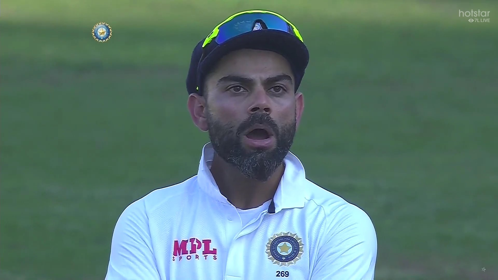
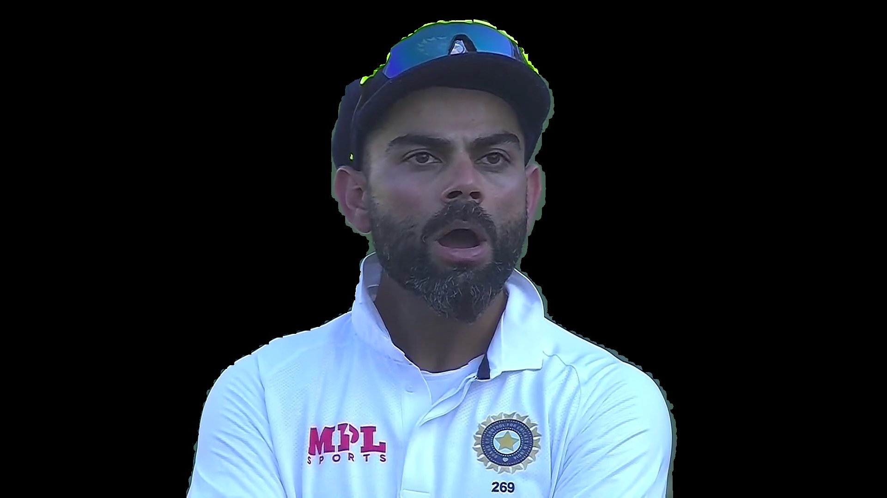

Use the video https://www.youtube.com/watch?v=k7cVPGpnels for initial learning.

<h1>sketch.py</h1>
The whole point of this is convert a picture to look like a cartoon sketch and the results are pretty good I feel.
First step is to take the input image and convert it to grey scale.
Second step is to invert this greyscale.
Then we use Gaussian blur to blur the inverted image.
Fourth step would be to invert back the blurred inverted image.
The final step is to divide the gray imaage with the Inverted blur image.
dividing the grayscale image by the inverse of the blurred image, remains with the highlights the boldest edges.
This results in the sketch of the uploaded image.

<h1>sketch_live.py</h1>
This file opens up the web camera and converts each frame into a sketch in real time.

<h1>bgremove.py</h1>
We are trying to build a background removal app and the modules used here are cvzone and mediapipe.

Import the SelfiSegmentation from cvzone.SelfiSegmentationModule.

The removeBG module removes the background of the image, not much to do here, will need to try how to do this from scratch some day.

